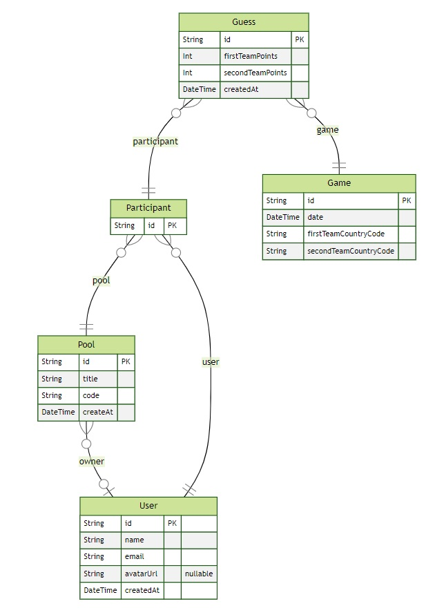

##
### World Cup
##

### Pré-Requisitos.

React.js, React Native, Node.js, JavaScript, TypeScript.

**Node.js**
- Site: https://nodejs.org/en/

**React.js**
- Site: https://pt-br.reactjs.org/

**Next.js**
- Site: https://nextjs.org/

**TypeScript**
- Site: https://www.typescriptlang.org/

**React Native**
- Site: https://reactnative.dev/


### Ferramentas do programador.

**Visual Studio Code**
- Site: https://code.visualstudio.com/download
- Extenção
    - `Prisma`

**Expo**
- Site: https://expo.dev/

**Expo Go**
- Site: https://expo.dev/client

**Android Studio**
- Site: https://developer.android.com/studio

**Postman**
- Site: https://www.postman.com/downloads/

**Insomnia**
- Site: https://insomnia.rest/download

**Hoppscotch**
- Site: https://hoppscotch.io/


### Figma
- Figma do projeto: https://www.figma.com/community/file/1169028343875283461

### Criação do projeto
**Setup do back-end**
- Fastify
- Prisma
- Banco de dados
- Diagrama ERD
- Contagem de balões


**Setup do front-end**
- Fundamentos React
- Next.js
- Banco de dados
- Buscando contagem de balões


##
### Back-End
##

- Instalando o Node e o NPM
- Windows
- Para conferir se a instalação foi um sucesso, basta abrir o seu terminal e digitar o comando:

```
node -v
```
- Para conferir a versão do npm que foi instalada:

```
npm -v
```

- Criar uma pasta `server`
- Criar o arquivo `packege.json`
```
npm init
```

- Instalar o TypeScript
```
npm i typescript -D
```
- Setup Ts `tsconfig.json`
```
npx tsc --init
```
- Alterar trecho de codigo no arquivo `tsconfig.json`
```json
/* Language and Environment */
    "target": "es2020", 
```

**Frame work**
- Instalar o frame work Fastify
```
npm i fastify
```

- Converter o arquivo `server.ts` para `server.js`
```
npx tsc
```

- Rodar o arquivo `server.ts`
```
node src/server.js
```

- Auto-compila
```
npm i tsx -D
```
- Apagar o arquivo `server.js`
- Alterar trecho de codigo no arquivo `package.json`
```json
  "scripts": {
    "dev": "tsx watch src/server.ts"
```

**Roda o projeto**
```
npm run dev
``` 

- Localhost: http://127.0.0.1:3333/

- Rotas

**Prisma**
- Instalando o prisma 
```
npm i prisma -D
```
- Dependência de produção
```
npm i @prisma/client
```
- Flag (Para o banco de dados SQLite)
```
npx prisma init --datasource-provider SQLite
```

**Tabela no prisma (Model)**
- Editar o arquivo `schema.prisma`

```prisma
// Tabela
model Pool {
  id String @id @default(cuid())
  title String
  code String @unique
  createAt DateTime @default(now())
}
```

- Migrate
```
npx prisma migrate dev
```
- Nome: > create table pools

**Banco de Dados**
- Visualizar o banco de dados pelo navegador
```
npx prisma studio
```
- Localhost: http://localhost:5555/


**Diagrama ERD**
- Diagrama de relacionamento de entidades
- Links Extra: https://www.edrawsoft.com/pt/what-is-entity-relationship-diagram-erd.html

- Localhost: http://localhost:3333/pools/count


**Mermaid-js**
- Site: https://github.com/mermaid-js/mermaid
```
npm i prisma-erd-generator @mermaid-js/mermaid-cli -D
```
- Cria o diagrama do banco de dados `svg` 
```
npx prisma generate
```
- Visualizando o `svg` criado no navegador
- Svg: http://127.0.0.1:5500/prisma/ERD.svg

**Bibliotecas**
- Fastify, Cors
```
npm i @fastify/cors
```

**Continuando o back-end**
- Estrutura do banco e relacionamentos
- Criando seed do banco de dados
- Criação de novo bolão
- Contagem de usuários
- Contagem de palpites

**Aplicação web**
- Layout da aplicação
- Conexão com API
- Criação do bolão


### Estrutura do banco e relacionamentos
- Criar as tabelas no arquivo `schema.prisma`
- Criar as migrate, tabelas no banco
```
npx prisma migrate dev
```
  - Nome: > `create db structure`

- Rodar o projeto
```
npx prisma studio
```
- Localhost: http://localhost:5555/


**ERD - Diagrama de relacionamento de entidades**
- Arquivo `ERD.svg` gerado
- Visualizar arquivo `ERD.svg` no navegador
- Diagrama

<p align="center">
  
</p>

- Country Code: https://countrycode.org/


### Criando seed do banco de dados
- Criar arquivo ´seed.ts´ dentro da pasta `prisma`
- Console do navegador
```js
new Date().toISOString()
```
- '2022-11-02T12:00:00.201Z'

- Altera trecho de código no arquivo `package.json`

```json
"prisma": {
  "seed": "tsx prisma/seed.ts"
},
```
- DB seed

```
npx prisma db seed
```

- Rodar o projeto
```
npx prisma studio
```
- Executa app backend
```
npm run dev
```


**Testes de Requisições**
- Postman, Hoppscotch, Insomnia
- Insomnia: https://insomnia.rest/download

**Bibliotecas**
- Schema-Validation

- Zod
```
npm i zod
```

- Short-unique-id
- Site: https://www.npmjs.com/package/short-unique-id 

```
npm i short-unique-id
```

**Rotas**
- Pools: http://localhost:3333/pools
- Pools-Count: http://localhost:3333/pools/count
- Guesses: http://localhost:3333/guesses/count
- Users: http://localhost:3333/users/count


##
### Front-End
##

- Criar o projeto React.js utilizando o Next.js

**Next.js**
- Site: https://nextjs.org/

- Instala a ultima versão do Next.js
```
npx create-next-app@latest --use-npm
```
- Nome do projeto `web`

**Roda o projeto**
```
npm run dev
```

- Localhost: http://localhost:3000/

- Clear, limpar o projeto
- Alterar a extenção do arquivo `_app.js` para `_app.tsx`
- Alterar a extenção do arquivo `_index.js` para `_index.tsx`

**JSX - JavaScript + XML (HTML)**
**TSX - TypeScript + JSX**

**Components**
- Exemplo de components React

```tsx
/*Exemplo de Componente React*/
export function Tweet(){
    return (
        <>
            <h1>Tweet</h1>
            <p>Lorem ipsum dolor sit amet consectetur adipisicing elit. Autem, esse.</p>
        </>
    );
}
```
- Incluir a importação do component no aquivo `index.tsx`
```tsx
/*importação no arquivo index.tsx*/
import { Tweet } from "../components/Tweet";

export default function Home() {
  return (
    <>
      <Tweet />
    </>    
  );
}
```

**Propriedades** **(Props)**
- Exemplo de Pripriedades(Atributos) React

```tsx
/*Exemplo de Componente React*/
export function Tweet(props){
    return (
        <>
            <h1>Tweet</h1>
            <p>{props.text}</p>
        </>
    );
}
```
- Incluir a importação do component no aquivo `index.tsx`
```tsx
/*importação no arquivo index.tsx*/
import { Tweet } from "../components/Tweet";

export default function Home() {
  return (
    <>
      {/*Exemplo de Props*/}
      <Tweet text="Meu Primeiro Tweet!"/>
    </>    
  );
}

```

**Server Side Rendering**
- Links Extras: https://medium.com/techbloghotmart/o-que-%C3%A9-server-side-rendering-e-como-usar-na-pr%C3%A1tica-a840d76a6dca


**Continuação do projeto**
- Criar a pasta `src` na raiz do projeto
- Mover a pasta `pages` para dentro da pasta `src`
- Criar a pasta `styles` dentro da pasta `src`
- Criar a pasta `assets` dentro da pasta `src`


##
### Settings.json
##

**Configurações**
- Vscode `Settings.json`
```js
{
  "emmet.syntaxProfiles" : {
    "javascript" : "jsx"
  },
  "workbench.startupEditor" : "newUntitledFile",
  "editor.fontSize" : 16,
  "javascript.suggest.autoImports" : true,
  "javascript.updateImportsOnFileMove.enabled" : "always",
  "editor.rulers" : [
    80,
    120
  ],
  "extensions.ignoreRecommendations" : true,
  "typescript.tsserver.log" : "off",
  "files.associations" : {
    ".sequelizerc" : "javascript",
    ".stylelintrc" : "json",
    "*.tsx" : "typescriptreact",
    ".env.*" : "dotenv",
    ".prettierrc" : "json"
  },
  "screencastMode.onlyKeyboardShortcuts" : true,
  "cSpell.userWords" : [
    "chakra",
    "IUGU",
    "middlewares",
    "mixpanel",
    "Onboarded",
    "prefetch",
    "rocketseat",
    "upsert"
  ],
  "editor.parameterHints.enabled" : false,
  "editor.renderLineHighlight" : "gutter",
  "cSpell.language" : "en,pt",
  "editor.lineHeight" : 26,
  "material-icon-theme.languages.associations" : {
    "dotenv" : "tune"
  },
  "typescript.updateImportsOnFileMove.enabled" : "never",
  "workbench.colorTheme" : "Omni",
  "material-icon-theme.files.associations" : {
    "tsconfig.json" : "tune",
    "*.webpack.js" : "webpack",
    "*.proto" : "3d",
    "ormconfig.json" : "database"
  },
  "material-icon-theme.activeIconPack" : "nest",
  "editor.suggestSelection" : "first",
  "explorer.confirmDelete" : false,
  "gitlens.codeLens.recentChange.enabled" : false,
  "terminal.integrated.showExitAlert" : false,
  
  "[prisma]" : {
    "editor.formatOnSave" : true
  },
    
  "typescript.suggest.autoImports" : true,
  "terminal.integrated.env.osx" : {
    "FIG_NEW_SESSION": "1"
  },
  "workbench.editor.labelFormat" : "short",
  "editor.fontLigatures" : true,
  "emmet.includeLanguages" : {
    "javascript" : "javascriptreact"
  },
  "liveshare.featureSet" : "insiders",
  "material-icon-theme.folders.associations" : {
    "adapters" : "contract",
    "grpc" : "pipe",
    "kube" : "kubernetes",
    "main" : "lib",
    "websockets" : "pipe",
    "implementations" : "core",
    "protos" : "pipe",
    "entities" : "class",
    "kafka" : "pipe",
    "use-cases" : "functions",
    "migrations" : "tools",
    "schemas" : "class",
    "useCases" : "functions",
    "eslint-config" : "tools",
    "typeorm" : "database",
    "_shared" : "shared",
    "mappers" : "meta",
    "fakes" : "mock",
    "modules" : "components",
    "subscribers" : "messages",
    "domain" : "class",
    "protocols" : "contract",
    "infra" : "app",
    "view-models" : "views",
    "presentation" : "template",
    "dtos" : "typescript",
    "http" : "container",
    "providers" : "include",
    "factories" : "class",
    "repositories" : "mappings"
  },
  "cSpell.enableFiletypes" : [
    "!asciidoc",
    "!c",
    "!cpp",
    "!csharp",
    "!go",
    "!handlebars",
    "!haskell",
    "!jade",
    "!java",
    "!latex",
    "!php",
    "!pug",
    "!python",
    "!restructuredtext",
    "!rust",
    "!scala",
    "!scss"
  ],
  "editor.acceptSuggestionOnCommitCharacter" : false,
  "explorer.compactFolders" : false,
  "git.enableSmartCommit" : true,
  "editor.accessibilitySupport" : "off",
  "explorer.confirmDragAndDrop" : false,
  "terminal.integrated.fontSize" : 14,
  "editor.codeActionsOnSave" : {
    "source.fixAll.eslint" : true,
    // "source.organizeImports": true
  },
  "editor.semanticHighlighting.enabled" : false,
  "breadcrumbs.enabled" : true,
  "workbench.productIconTheme" : "fluent-icons",
  "editor.fontFamily" : "JetBrains Mono",
  "gitlens.codeLens.authors.enabled" : false,
  "editor.tabSize" : 2,
  "security.workspace.trust.untrustedFiles" : "newWindow",
  "files.exclude" : {
    "**\/CVS" : true,
    "**\/.DS_Store" : true,
    "**\/.hg" : true,
    "**\/.svn" : true,
    "**\/.git" : true
  },
  "tabnine.experimentalAutoImports" : true,
  "gitlens.codeLens.enabled": false,
  "workbench.iconTheme": "material-icon-theme"
}
```


##
### 
##

- By:  **Daniel Oliveira**

  - `Instagram` - https://www.instagram.com/danieloliv3/
  - `Facebook` - https://web.facebook.com/danielsapup3/
  - `Twitter` - https://twitter.com/danielsapup3/
  - `Linkedin` - https://www.linkedin.com/in/danielsapup3/

##